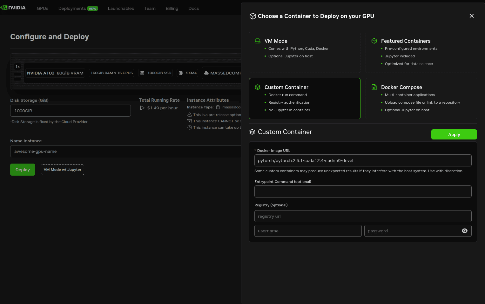

# Brev Setup



Go to [https://brev.nvidia.com/](https://brev.nvidia.com/) -> Sign up / Log in.

Create new instance -> Select GPU (A100) -> Select model (all similar) -> click VM Mode w/ Jupyter -> Custom Container -> Docker image: `davideborg/borg-isaac-gr00t:dev` -> Deploy -> Wait.

Replace `awesome-gpu-name` with your instance name and run:
```bash
brev shell awesome-gpu-name
```

Clone the repo and enter it:
```bash
cd /workspace
git clone https://github.com/Borg-Robotics/Isaac-GR00T.git
cd Isaac-GR00T
```

Download the dataset with
```bash
gdown https://drive.google.com/uc?id=1GskDY-CmQOefoVxj9xVohgiJ3worHKqd -O box_pickup_dataset.zip
unzip box_pickup_dataset.zip
mkdir -p ./data
mv ./box_pickup_dataset ./data/box_pickup_dataset
rm box_pickup_dataset.zip
```

Load the dataset with
```bash
MPLBACKEND=Agg python3 scripts/load_dataset.py   --dataset-path /workspace/Isaac-GR00T/data/box_pickup_dataset
```

Run the training with
```bash
python scripts/gr00t_finetune.py \
    --dataset-path /workspace/Isaac-GR00T/data/box_pickup_dataset \
    --num-gpus 1 \
    --max-steps 500 \
    --output-dir /tmp/gr00t-1/box-pickup-finetune \
    --data-config borg_no_hands \
    --embodiment-tag borg_no_hands
```

Run the server/client inference in two different terminals:
```bash
python scripts/inference_service.py \
    --server \
    --model-path /tmp/gr00t-1/box-pickup-finetune \
    --embodiment-tag borg_no_hands \
    --data-config borg_no_hands \
    --port 5556
```

```bash
python scripts/inference_service.py \
    --client \
    --embodiment-tag borg_no_hands \
    --data-config borg_no_hands \
    --port 5556
```