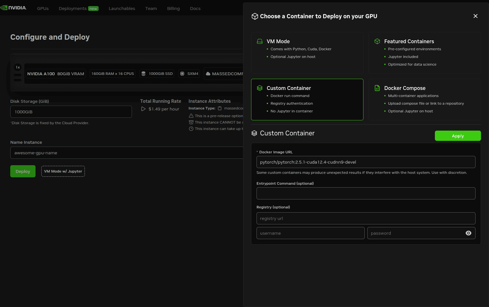

# Brev Setup



Go to [https://brev.nvidia.com/](https://brev.nvidia.com/) -> Sign up / Log in.

Create new instance -> Select GPU (A100) -> Select model (all similar) -> click VM Mode w/ Jupyter -> Docker Compose -> GitHub URL: `https://github.com/Borg-Robotics/Isaac-GR00T/blob/main/docker/cloud_compose.yaml` -> Validate -> Save and Continue -> Deploy.

Replace `awesome-gpu-name` with your instance name and run:
```bash
brev shell awesome-gpu-name
```

Clone the repo and enter it:
```bash
mkdir -p workspace
cd workspace
git clone https://github.com/Borg-Robotics/Isaac-GR00T.git
cd Isaac-GR00T
```

Rebuild the docker image in detached mode (`-d`):
```bash
docker compose -f docker/brev_compose.yaml up --build -d
```

Enter it with:
```bash
docker exec -it brev-borg-isaac-gr00t bash
```

Download the dataset with
```bash
gdown --folder https://drive.google.com/drive/folders/1qDykMJSplterueCXxjLe13bdGWcxw0HC
mkdir -p ./data
mv ./box_pickup_dataset ./data/box_pickup_dataset
chown -R 1002 ./data
```
note that `chown` assumes the outside user id is 1002, change accordingly if it is not (check with `id -u` **outside** of Docker). You will have permissions errors in vscode otherwise.

Load the dataset with
```bash
MPLBACKEND=Agg python3 scripts/load_dataset.py   --dataset-path /workspace/data/box_pickup_dataset
```

Run the training with
```bash
python scripts/gr00t_finetune.py \
    --dataset-path /workspace/data/box_pickup_dataset \
    --num-gpus 1 \
    --max-steps 500 \
    --output-dir /tmp/gr00t-1/box-pickup-finetune \
    --data-config borg \
    --embodiment-tag borg
```

Run the server/client inference in two different terminals:
```bash
python scripts/inference_service.py \
    --server \
    --model-path /tmp/gr00t-1/box-pickup-finetune \
    --embodiment-tag borg \
    --data-config borg \
    --port 5556
```

```bash
python scripts/inference_service.py \
    --client \
    --embodiment-tag borg \
    --data-config borg \
    --port 5556
```
This will tell you if everything is working correctly and the model is able to run inference.

## Evaluate Fine-Tuned Model

This replays an unseen test episode through the fine-tuned model and compares predicted actions against ground truth.

Copy the test episode data (parquet + video) into the dataset folder:
```bash
cp /workspace/data/box_pickup_dataset/data/chunk-000/episode_000005.parquet /workspace/data/box_pickup_dataset/data/chunk-000/
cp -r /workspace/data/box_pickup_dataset/videos/chunk-000/episode_000005 /workspace/data/box_pickup_dataset/videos/chunk-000/
```

Start the inference server (in one terminal):
```bash
python scripts/inference_server_2.py \
    --model-path /tmp/gr00t-1/box-pickup-finetune \
    --embodiment-tag borg \
    --data-config borg \
    --port 5556
```

Run the evaluation (in another terminal):
```bash
python scripts/evaluate_replay.py \
    --dataset-path /workspace/data/box_pickup_dataset \
    --episode-id 5 \
    --port 5556
```

This outputs per-joint MAE metrics and saves a comparison plot.

## Test Remote Connection (Local → Brev)

This verifies ZMQ connectivity from a local machine to the Brev instance.

On Brev (inside Docker), start the echo server:
```bash
python scripts/server_echo.py
```

On your local machine, forward local port 5557 to Brev port 5556 (replace `awesome-gpu-name2` with your instance name):
```bash
brev port-forward awesome-gpu-name2 -p 5557:5556
```

On your local machine, run the echo client:
```bash
python scripts/client_echo.py
```

## VS Code Remote Development

Open VS Code in the brev instance with (replace `awesome-gpu-name` with your instance name):
```bash
brev open awesome-gpu-name code
```

Install the Dev Containers extension in VS Code.

- CTRL+SHIFT+P -> 
- Search for `Dev Containers: Attach to Running Container` and select it -> 
- Select the brev docker image (`brev-borg-isaac-gr00t` which starts once you run the docker compose command above) ->
- Open the `/workspace` folder.